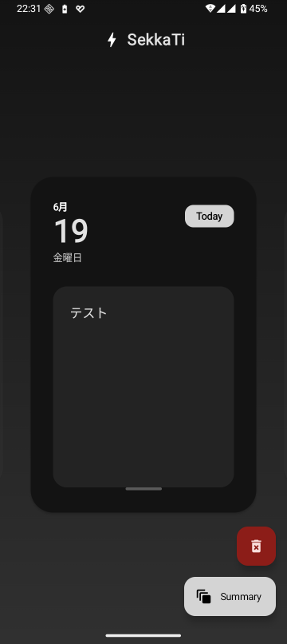

# SekkaTi Android

Desktop版「SekkaTi」をAndroidアプリとして再現。せっかちさんのためのメモ帳。さっと出して、書いて、しまう。

## デモ

## 技術スタック
- Kotlin / Jetpack Compose (Material 3)
- Room (SQLite)
- WorkManager
- Coroutines & Flow
- MVVM
- KSP (Kotlin Symbol Processing)

## License
MIT
